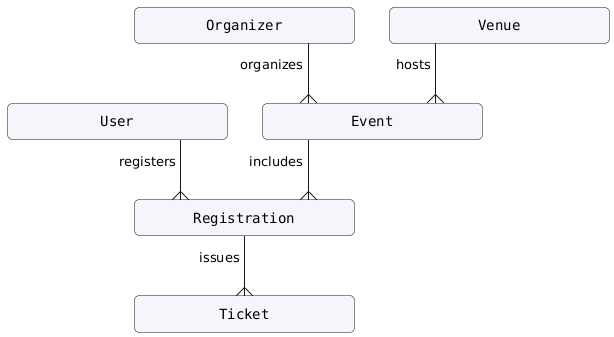
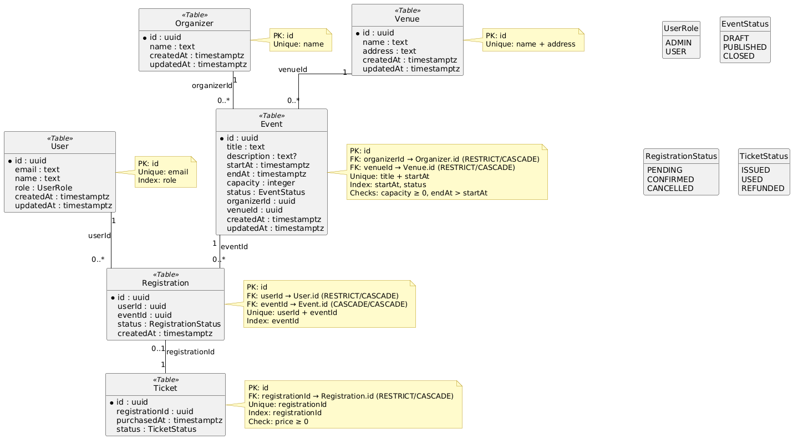

# Rapport Projet — Evently

## Membres du groupe
Bourragué Maxence -/-
Scarfone Louis

---

### 1. Présentation du Projet
Evently est une application de gestion d’événements combinant PostgreSQL pour le cœur transactionnel (utilisateurs, organisateurs, lieux, événements, inscriptions, tickets) et MongoDB pour le flux d’activité temps réel (commentaires, check-ins, photos). L’objectif est d’offrir une gestion fiable des inscriptions/tickets avec contraintes et transactions ACID, tout en proposant un fil social flexible et scalable par événement. Les principales fonctionnalités: création/édition d’événements, gestion des lieux/organisateurs, inscription des utilisateurs, émission et suivi des tickets, fil d’actualité et analytics du feed.

### 2. Architecture PostgreSQL (Méthode Merise)

**MCD (Modèle Conceptuel de Données)**



**MLD (Modèle Logique de Données)**



**MPD (Modèle Physique de Données)**

```sql
-- Script de création (PostgreSQL)

-- CreateEnums
CREATE TYPE "UserRole" AS ENUM ('ADMIN', 'USER');
CREATE TYPE "EventStatus" AS ENUM ('DRAFT', 'PUBLISHED', 'CLOSED');
CREATE TYPE "RegistrationStatus" AS ENUM ('PENDING', 'CONFIRMED', 'CANCELLED');
CREATE TYPE "TicketStatus" AS ENUM ('ISSUED', 'USED', 'REFUNDED');

-- CreateTables
CREATE TABLE "User" (
    "id" TEXT NOT NULL,
    "email" TEXT NOT NULL,
    "name" TEXT NOT NULL,
    "role" "UserRole" NOT NULL DEFAULT 'USER',
    "createdAt" TIMESTAMP(3) NOT NULL DEFAULT CURRENT_TIMESTAMP,
    "updatedAt" TIMESTAMP(3) NOT NULL,

    CONSTRAINT "User_pkey" PRIMARY KEY ("id")
);
CREATE TABLE "Organizer" (
    "id" TEXT NOT NULL,
    "name" TEXT NOT NULL,
    "createdAt" TIMESTAMP(3) NOT NULL DEFAULT CURRENT_TIMESTAMP,
    "updatedAt" TIMESTAMP(3) NOT NULL,

    CONSTRAINT "Organizer_pkey" PRIMARY KEY ("id")
);
CREATE TABLE "Venue" (
    "id" TEXT NOT NULL,
    "name" TEXT NOT NULL,
    "address" TEXT NOT NULL,
    "createdAt" TIMESTAMP(3) NOT NULL DEFAULT CURRENT_TIMESTAMP,
    "updatedAt" TIMESTAMP(3) NOT NULL,

    CONSTRAINT "Venue_pkey" PRIMARY KEY ("id")
);
CREATE TABLE "Event" (
    "id" TEXT NOT NULL,
    "title" TEXT NOT NULL,
    "description" TEXT,
    "startAt" TIMESTAMP(3) NOT NULL,
    "endAt" TIMESTAMP(3) NOT NULL,
    "capacity" INTEGER NOT NULL,
    "status" "EventStatus" NOT NULL DEFAULT 'DRAFT',
    "organizerId" TEXT NOT NULL,
    "venueId" TEXT NOT NULL,
    "createdAt" TIMESTAMP(3) NOT NULL DEFAULT CURRENT_TIMESTAMP,
    "updatedAt" TIMESTAMP(3) NOT NULL,

    CONSTRAINT "Event_pkey" PRIMARY KEY ("id")
);
CREATE TABLE "Registration" (
    "id" TEXT NOT NULL,
    "userId" TEXT NOT NULL,
    "eventId" TEXT NOT NULL,
    "status" "RegistrationStatus" NOT NULL DEFAULT 'PENDING',
    "createdAt" TIMESTAMP(3) NOT NULL DEFAULT CURRENT_TIMESTAMP,

    CONSTRAINT "Registration_pkey" PRIMARY KEY ("id")
);
CREATE TABLE "Ticket" (
    "id" TEXT NOT NULL,
    "registrationId" TEXT NOT NULL,
    "price" DECIMAL(10,2) NOT NULL,
    "purchasedAt" TIMESTAMP(3) NOT NULL DEFAULT CURRENT_TIMESTAMP,
    "status" "TicketStatus" NOT NULL DEFAULT 'ISSUED',

    CONSTRAINT "Ticket_pkey" PRIMARY KEY ("id")
);

-- CreateIndexes
CREATE UNIQUE INDEX "User_email_key" ON "User"("email");
CREATE INDEX "User_role_idx" ON "User"("role");
CREATE UNIQUE INDEX "Organizer_name_key" ON "Organizer"("name");
CREATE INDEX "Event_startAt_idx" ON "Event"("startAt");
CREATE INDEX "Event_status_idx" ON "Event"("status");
CREATE UNIQUE INDEX "Event_title_startAt_key" ON "Event"("title", "startAt");
CREATE INDEX "Registration_eventId_idx" ON "Registration"("eventId");
CREATE UNIQUE INDEX "Registration_userId_eventId_key" ON "Registration"("userId", "eventId");
CREATE INDEX "Ticket_registrationId_idx" ON "Ticket"("registrationId");
CREATE UNIQUE INDEX "Ticket_registrationId_key" ON "Ticket"("registrationId");
CREATE UNIQUE INDEX "Venue_name_address_key" ON "Venue"("name", "address");

-- AddForeignKeys
ALTER TABLE "Event" ADD CONSTRAINT "Event_organizerId_fkey" FOREIGN KEY ("organizerId") REFERENCES "Organizer"("id") ON DELETE RESTRICT ON UPDATE CASCADE;
ALTER TABLE "Event" ADD CONSTRAINT "Event_venueId_fkey" FOREIGN KEY ("venueId") REFERENCES "Venue"("id") ON DELETE RESTRICT ON UPDATE CASCADE;
ALTER TABLE "Registration" ADD CONSTRAINT "Registration_userId_fkey" FOREIGN KEY ("userId") REFERENCES "User"("id") ON DELETE RESTRICT ON UPDATE CASCADE;
ALTER TABLE "Registration" ADD CONSTRAINT "Registration_eventId_fkey" FOREIGN KEY ("eventId") REFERENCES "Event"("id") ON DELETE CASCADE ON UPDATE CASCADE;
ALTER TABLE "Ticket" ADD CONSTRAINT "Ticket_registrationId_fkey" FOREIGN KEY ("registrationId") REFERENCES "Registration"("id") ON DELETE RESTRICT ON UPDATE CASCADE;

-- ComplementaryChecks
ALTER TABLE "Event" ADD CONSTRAINT "Event_capacity_chk" CHECK ("capacity" >= 0);
ALTER TABLE "Event" ADD CONSTRAINT "Event_dates_chk" CHECK ("endAt" > "startAt");
ALTER TABLE "Ticket" ADD CONSTRAINT "Ticket_price_chk" CHECK ("price" >= 0);
```

### 3. Architecture MongoDB

Le flux d’activité d’un événement est stocké dans MongoDB, avec des collections dédiées:
- `event_feeds`: un document par événement avec une liste d’entrées référencées
- `comments`, `checkins`, `photos`: contenus atomiques référencés par le feed

```json
// event_feeds
{
  "_id": "66f1…",
  "eventId": "<uuid de l'événement>",
  "entries": [
    { "type": "COMMENT", "itemId": "66f2…", "ts": "2025-01-10T10:20:30.000Z" },
    { "type": "CHECKIN", "itemId": "66f3…", "ts": "2025-01-10T10:21:10.000Z" },
    { "type": "PHOTO", "itemId": "66f4…", "ts": "2025-01-10T10:22:00.000Z" }
  ]
}

// comments
{ "_id": "66f2…", "eventId": "<uuid>", "message": "Hâte de participer !", "author": "Alice", "ts": "2025-01-10T10:20:30.000Z" }

// checkins
{ "_id": "66f3…", "eventId": "<uuid>", "attendee": { "name": "Alice", "email": "alice@example.com" }, "source": "QR", "meta": null, "ts": "2025-01-10T10:21:10.000Z" }

// photos
{ "_id": "66f4…", "eventId": "<uuid>", "url": "https://…/photo.jpg", "caption": "Scene", "ts": "2025-01-10T10:22:00.000Z" }
```

### 4. Justification des Choix Techniques

**Répartition des données**
- PostgreSQL (ACID) pour le cœur transactionnel: `User`, `Organizer`, `Venue`, `Event`, `Registration`, `Ticket`. Besoin d’intégrité référentielle, de contraintes (unicités, checks, FK), de transactions atomiques (ex: inscription + émission de ticket), et de jointures fiables pour le reporting.
- MongoDB (BASE) pour le flux d’activité temps réel lié aux événements: `comments`, `checkins`, `photos` et un `event_feeds` léger pour orchestrer l’affichage. Écritures fréquentes, schéma souple, agrégations simples et expérience live.

**Modélisation MongoDB — références plutôt qu’imbrication**
Nous stockons dans `event_feeds.entries` des références `{ type, itemId, ts }` vers des collections spécialisées (`comments`, `checkins`, `photos`) au lieu d’imbriquer tout le contenu dans un seul document.
- Taille et croissance non bornées: un flux peut contenir des milliers d’items. En imbrication, le document du feed grossit indéfiniment jusqu’à la limite de 16 MB et devient coûteux à déplacer/mettre à jour. Les références gardent le feed léger et les contenus volumineux séparés.
- Conflits d’écriture et hotspots: écrire/append dans un tableau imbriqué crée de la contention sur UN document « chaud ». Avec des références, chaque nouvel item est écrit dans sa collection dédiée, réduisant les conflits et améliorant le débit.
- Lectures sélectives et pagination: on liste d’abord `entries` (types + ids), puis on charge seulement les items nécessaires (dernières N photos, commentaires paginés). On évite de rapatrier un énorme tableau imbriqué à chaque lecture.
- Normalisation légère et réutilisation: un commentaire/photo/checkin est une entité adressable (modération, suppression, audit). La référence permet des opérations ciblées sans réécrire un gros document parent.
- Indexation ciblée et analytics: index par collection (`comments.eventId`, `checkins.ts`, etc.) et agrégations dédiées. À l’inverse, indexer profondément des sous-documents imbriqués reste plus contraint et moins flexible.
- Évolution indépendante des schémas: chaque type d’item peut évoluer (nouveaux champs, TTL, métadonnées) sans migration d’un tableau imbriqué géant.

L'imbrication est à privilégier lorsque les sous-documents sont petits, en nombre borné, lus/écrits toujours avec le parent et nécessitent des garanties atomiques au niveau document. Ce n’est pas le cas d’un flux potentiellement long, multi-type et à fort taux d’append.

**Relations inter-bases**
- Clé d’articulation: les documents MongoDB portent `eventId` (UUID Postgres) comme clé applicative; pas de FK inter-SGBD, la cohérence est gérée au niveau service.
- Cohérence forte là où nécessaire: les opérations métier critiques (capacity, paiement, ticket) vivent dans Postgres (transactions). Le flux MongoDB accepte une cohérence éventuelle (écritures asynchrones).
- Cycle de vie: à la suppression d’un événement, une tâche applicative nettoie `event_feeds` et contenus associés via `eventId`.
- Dénormalisation contrôlée: on peut stocker des champs d’affichage (ex. `eventTitle`) dans les items Mongo pour le confort UI, mais la source de vérité reste Postgres.


### 5. Exemples de Requêtes Complexes
**PostgreSQL**

```sql
-- Liste des événements avec organisateur, lieu et nombre d'inscriptions
SELECT e.id, e.title, e."startAt", e."endAt", e.capacity, e.status,
       o.name AS organizer_name,
       v.name AS venue_name,
       COALESCE(COUNT(r.id), 0) AS registration_count
FROM "Event" e
JOIN "Organizer" o ON o.id = e."organizerId"
JOIN "Venue" v ON v.id = e."venueId"
LEFT JOIN "Registration" r ON r."eventId" = e.id
GROUP BY e.id, o.name, v.name
ORDER BY e."startAt" ASC;
```

**MongoDB**

```javascript
// Répartition des entrées par type (aggregate sur event_feeds)
db.event_feeds.aggregate([
  { $match: { eventId: "<uuid>" } },
  { $unwind: "$entries" },
  { $group: { _id: "$entries.type", count: { $sum: 1 } } },
  { $project: { _id: 0, type: "$_id", count: 1 } }
]);
```

## 6. Stratégie de Sauvegarde

### PostgreSQL

#### **Méthode proposée**

* **Outil** : `pg_dump` (sauvegarde logique)
  Permet d’exporter la base sous forme de script SQL ou d’archive compressée. Cette méthode est simple à automatiser (cron job) et adaptée aux bases de taille moyenne.
* **Alternative avancée** : **Sauvegarde continue (PITR)** via `pg_basebackup` + archivage des **WAL (Write Ahead Logs)**
  → Cette approche permet une **récupération à un instant précis** (“Point In Time Recovery”), utile pour minimiser la perte de données en cas d’incident majeur.

#### **Fréquence**

* **Sauvegarde complète** : 1 fois par jour (nuit, faible charge serveur).
* **Sauvegarde incrémentale** (via WAL) : en continu, chaque modification est archivée.
  → Cela permet de restaurer la base à tout moment de la journée sans perdre les transactions récentes.

#### **Procédure de restauration**

1. Arrêter le service PostgreSQL.
2. Restaurer la dernière sauvegarde complète avec `pg_restore` (ou réimporter le dump SQL).
3. Réappliquer les journaux WAL si disponibles pour revenir à un instant précis.
4. Redémarrer le service et vérifier l’intégrité des données.

---

### MongoDB

#### **Méthode proposée**

* **Outil** : `mongodump` / `mongorestore`
  Sauvegarde au format BSON, pratique pour exporter/restaurer des collections ou bases entières.
* **Alternative de haute disponibilité** : **Replica Set**
  → Un ensemble de serveurs (primaire + secondaires) maintient des copies synchronisées. En cas de panne du nœud principal, un autre prend le relais automatiquement, limitant la perte de données.

#### **Fréquence**

* **Sauvegarde complète** : chaque nuit (par `mongodump`).
* **Sauvegarde différentielle/incrémentale** : possible via **oplog** (journal des opérations) si replica set activé.
  → Permet de rejouer uniquement les modifications depuis la dernière sauvegarde complète.

#### **Procédure de restauration**

1. Si replica set : promotion automatique d’un nœud secondaire (aucune action manuelle nécessaire).
2. Sinon, restauration manuelle via `mongorestore` :

   * Stopper le service si nécessaire.
   * Importer la dernière sauvegarde.
   * Rejouer les opérations depuis l’oplog si disponible.
3. Vérifier la cohérence et la connexion des applications clientes.

---

### Synthèse comparative

| Base de données | Méthode principale        | Fréquence                    | Avantage clé                     | Restauration                           |
| --------------- | ------------------------- | ---------------------------- | -------------------------------- | -------------------------------------- |
| **PostgreSQL**  | `pg_dump` + WAL           | Quotidienne + continue       | Restauration à un instant précis | `pg_restore` + WAL                     |
| **MongoDB**     | `mongodump` + Replica Set | Quotidienne + journaux oplog | Haute disponibilité automatique  | `mongorestore` ou failover automatique |

---
